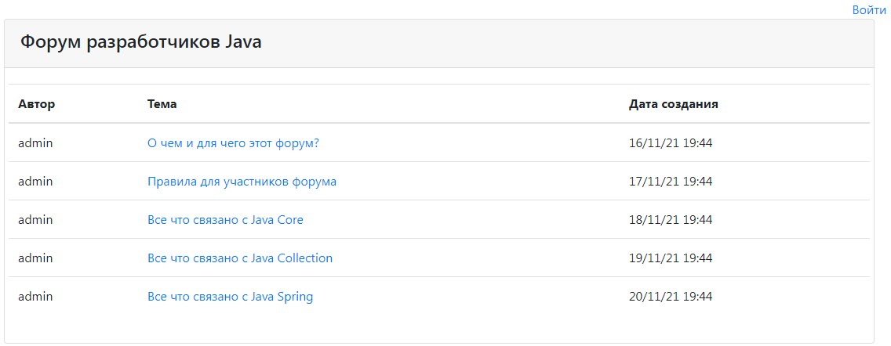

# job4j_forum

В данном проекте реализован интернет форум.
Реализован функционал создания топиков, регистрации и авторизации пользователей.
Пользователи делятся на обычных и администраторов.
Простые пользователи могут создавать новые топики, постить сообщения,
редактировать существующие топики и сообщения не могут. Администраторам
доступен весь функционал.

Скриншоты:
1. Главная страница форума.
   
2. Страница регистрации в системе.
   
3. Страница авторизации в системе.
   
4. У авторизованного пользователя нет кнопок редактирования и удаления.
   
5. У авторизованного администратора есть возможность редактирования и удаления.
   
6. Форма создания новой темы форума.
   
7. Форма редактирования существующей темы.
   
8. Страница темы с сообщениями. Редактировать и удалять сообщения могут
   только администраторы.
   